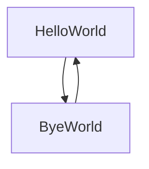

# Tebot

[](https://www.nuget.org/packages/Tebot/)


This is a small wrapper library for Telegram.Bot. With it, you can simplify the creation of complex bot logic. In `TebotConsole` you can find a example small console app.

## Why?   
When you try to make telegram bot on Telegram.Bot, you usually have one big method like `OnUpdate(Update update, ...)` which process every update. And in this method you usually have a lot of if/else, switch and other shit. With this, you method easy can grow up to many lines of code.\n\n
But with this libary we can represent user as class instance, and all updates and actions from concrete user will be applyed only to class instance

## Base usage
For first, you should create you own class, which derivites from `Tebot.Base`, for example
```
public class Bot : Base{
    
}
```
All class have a thing which we call "State". So, with this we can have class as State machine. Lets create class with 2 states:
```
public class StateMachine : Base{
    [StateId(State = "/start")]
    public async Task HelloWorld(){
        await Bot.SendTextMessageAsync(UserId, "Hello world");
        NextState = "Bye";
    }
    [StateId(State = "Bye")]
    public async Task ByeWorld(){
        await Bot.SendTextMessageAsync(UserId, "Bye world");
        NextState = "/start";
    }
}
```
So, what happens here? To get a better representation, we can to look on graph:\n

In general, when we send message to bot, he execute surrent state. Surrent state defined by `NextState` variable. To make a new state, we should create new method and add `StateId` attribute to him.\n\n
And, in general, it`s looks like
1. User send message to bot in telegram app
2. Invokes `HelloWorld()` method.(because default value for `NextState` variable is a `/start`, but of course we can override this)
3. Call `await Bot.SendTextMessageAsync(UserId, "Hello world");`, which send to user `Hello world` string. `UserId` in this context is a `long` variable, defined in `Base` class and represent actual user account id.
4. `NextState = "Bye";` - we set `Bye` as next state. After this, method ends.
5. Now user can send another message to bot.
6. After we recive new message, `Tebot` invoke `ByeWorld` method, because his have `StateId` attribute with `Bye` value.
7. We again send message to user
8. We set next state to `/start` etc we return to step 1.

And now we need only to add main method:
```
static void Main(string[] args)
    {
        var tb = new Tebot.Tebot("6510000000:AAGCKkSY***", typeof(StateMachine), StateLoader.Empty());
        tb.Run();
        Console.ReadKey();
        tb.Stop();
    }
```
Where first argument is bot token, second - `Type` to our class, and third - don`t thing about it now.

## Going deeper
### Dependency Injection
Library support dependency injection. To this, pass `IServiceProvider` in `Tebot` constructor. If not set, class will try to create objects by himself, pass to his constructors null value.

### Host
It\`s recommend to use `Microsoft.Extensions.Hosting` to create application. Example you can find 

### Commands
Telegram Bots have commands concept, and this library support it. Commands is very simular to states:
```
[Command("/value")]
public async Task Bebrachka(int abb = 150){
    await Bot.SendTextMessageAsync(UserId, $"value x{abb}");
}
```
Command methods can have parameters, which will be set from command. For example, if we send to bot `/value 200`, then `abb` value will be a 200. If we send only `/value`, `abb` will be equal to default value. Now lib can parce only `System.Int32`, `System.Int64`, `System.Double` and `System.String`.

### Override methods
`Base` class have some methods, which we can override in our class.
| Method      | Method Description |
| ----------- | ----------- |
| `OnLoad()` | Event, when class instance was loaded |
| `OnInlineQuery()` | When update represents `InlineQuery` |
| `OnCallback()` | When user click on inline button with callback |
| `OnCreate()` | Call once after create this `Base` instanse by library. |
| `OnCommand()` | Call if user input is command(starts from `/` |
| `OnUpdate()` | Call after each update with this user |
| `ProccessUnknownState()` | Called when `NextState` value can\`t be matched with state |
| `OnException()` | If in state we have unhandled exception, library call this method |
